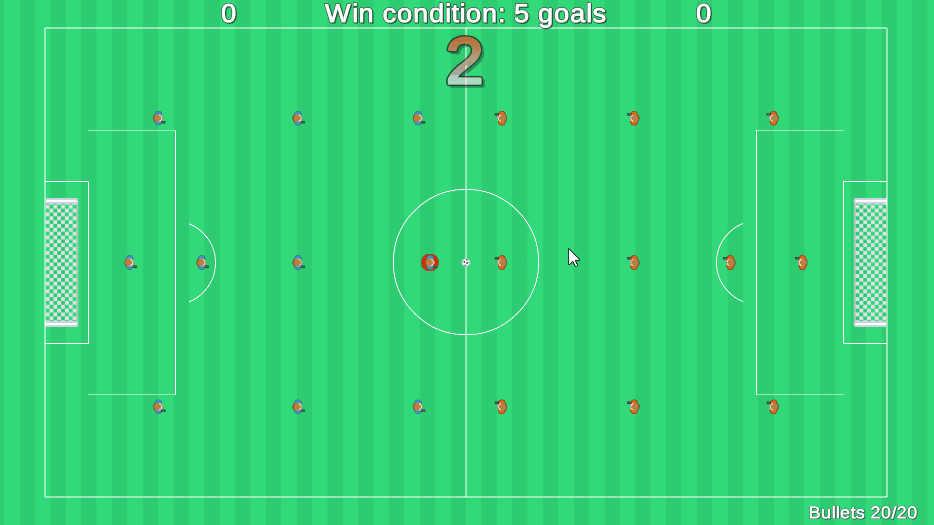

# [Unity] Shotty-Soccer
## Game originally created on 2018-04 for Ludum Dare 41 (72 hour international game jam).
#### Last opened with Unity Editor version: 2017.4.33f1 ####

Theme of the game jam was "Combine 2 Incompatible Genres". So this is my implementation of the theme.

The game is "fully" finished, but it lacks game balance, better and more thorough controls and many more things.

Assets used from <a href="https://kenney.nl/assets/sports-pack">Kenney</a>

Built exe with data for desktop <a href="https://www.dropbox.com/s/bly5kd7tmers3yg/ShotySoccer.zip?dl=0">download</a>

